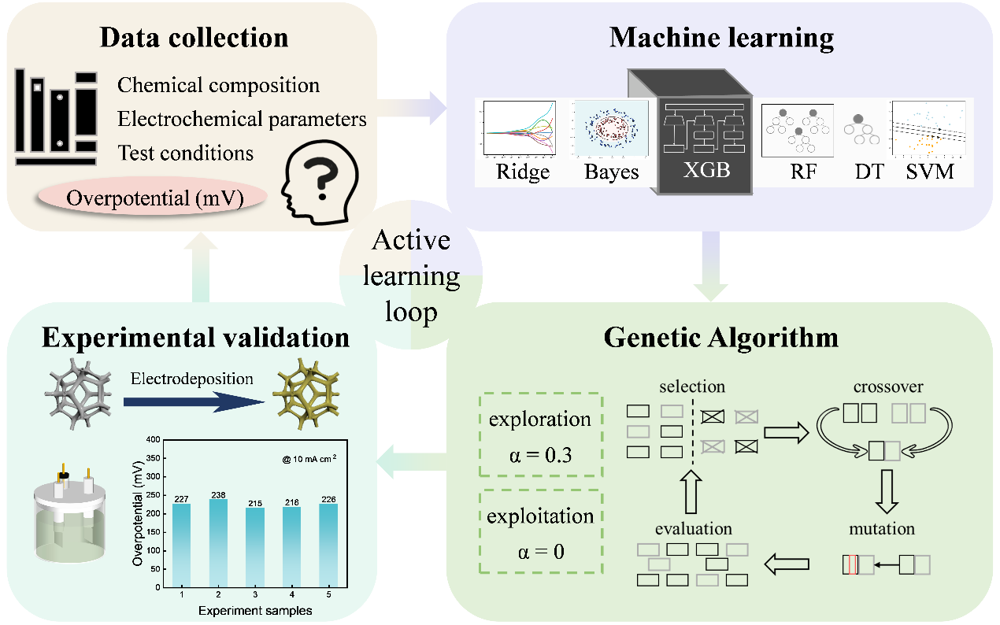

# Machine Learning-Guided Genetic Algorithm for Accelerated Screening and Experimental Validation of Plasma-Assisted Ni-Fe-Based OER Electrocatalysts

> **Note:** This is the repository for the paper *Machine Learning-Guided Genetic Algorithm for Accelerated Screening and Experimental Validation of Plasma-Assisted Ni-Fe-Based OER Electrocatalysts*. 
>
> 🚀 **The source code, processed datasets, and pre-trained models will be made publicly available upon the formal acceptance of the manuscript.**

---

## 📖 Abstract

Nickel-iron-based catalysts show great promise for the oxygen evolution reaction (OER). Specifically, plasma-assisted and electrodeposition methods are compatible with large-scale industrial fabrication. However, the vast compositional space remains largely unexplored due to the inefficiency of traditional trial-and-error discovery. In this work, we develop a **machine learning-guided genetic algorithm (ML-GA) paradigm** with two complementary modes: **exploration and exploitation**. The exploration mode balances population diversity and predicted performance to broadly search the chemical space, while the exploitation mode focuses on high-performance regions to identify promising catalysts.Guided by this framework, **NiFe/NiS catalysts were synthesized via plasma-assisted electrodeposition** and demonstrated remarkable OER activity, achieving low overpotentials of **218 mV** and **315 mV** at current densities of **10** and **1000 mA cm⁻²**, respectively. This work provides a demonstration of the effectiveness of the ML-GA approach in overcoming data limitations and accelerating the design of high-performance OER electrocatalysts.

---

## ✨ Key Highlights

- **A dual-mode ML-GA framework** We established a "closed-loop" strategy combining **exploration** and **exploitation** modes to mitigate data limitations and efficiently screen the vast compositional space. Specifically, the exploration mode ensures broad searching under uneven data distributions to iteratively update the models, while the exploitation mode concentrates on driving the search toward high-performance regions.

- **Transferable Paradigm for Plasma Processing** The framework successfully navigated the complex parameter space of **plasma-assisted electrodeposition**, demonstrating a transferable paradigm for plasma-based materials processing.

- **Superior experimental performance** The experimentally validated NiFe/NiS catalyst demonstrated outstanding activity and stability under industrial-level current densities, verifying the practical effectiveness of our data-driven approach.

---

## 🛠️ Framework Overview

The proposed catalyst design framework is based on an **active learning closed loop** and mainly comprises four steps, as illustrated in Figure 1. These steps include **data collection**, **machine learning**, **genetic algorithm**, and **experimental validation**.


*(Figure 1. Framework to discover Ni-Fe-based electrocatalysts for OER)*

### The Four-Step Workflow:
1. **Data Collection**: Aggregating and cleaning OER dataset from published literature.
2. **Machine Learning**: Training and optimizing surrogate models to predict overpotentials ($\eta$) based on synthesis descriptors.
3. **Genetic Algorithm**: Using a dual-mode GA (**Exploration** & **Exploitation**) to generate virtual catalyst candidates and screen for optimal synthesis conditions.
4. **Experimental Validation**: Synthesizing the top-ranked candidates via **plasma-assisted electrodeposition** to verify performance and provide feedback to the model.

---

## 📅 Roadmap to Release

We are committed to open science. The following assets will be released:

- [ ] **Source Code**: Complete Python implementation of the Dual-Mode GA and ML training scripts.
- [ ] **Datasets**: The cleaned and preprocessed OER dataset used for model training.

---

## 🔗 Citation

If you find this work helpful, please consider citing our paper (BibTeX entry will be updated upon publication):

```bibtex

